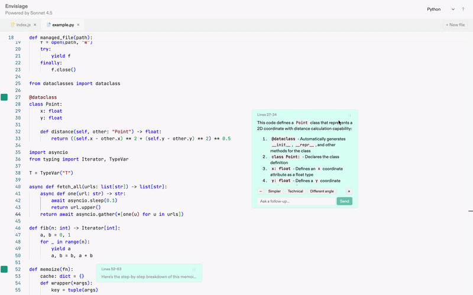

# **Envisiage**

Envisiage is an inline code tutor that runs in the browser. You work in a multi-file Monaco editor (with tabs), select code, and get AI-powered explanations at different granularities. Explanations stream in a resizable side panel, with optional follow-up Q&A per annotation.

<p align="center">
  
</p>

## **Prerequisites**

- **Node.js** (v18 or later)
- **npm** (v9 or later)
- **AI explanations (optional):** An Anthropic API key. Without it, the `/api/explain` and `/api/followup` endpoints return an error when you request an explanation or follow-up.

## **Local Development**

1. **Clone the repository:**
   ```bash
   git clone https://github.com/yourusername/envisiage.git
   cd envisiage
   ```

2. **Install dependencies:**
   ```bash
   npm install
   ```

3. **Create a `.env` file** in the root and add your Anthropic API key (optional, for AI features):
   ```bash
   ANTHROPIC_API_KEY=your_api_key_here
   ```

4. **Start the development server:**
   ```bash
   npm run dev
   ```

5. **Open [http://localhost:5173](http://localhost:5173)** in your browser. Select some code and press **⌘⇧E** (or click **Explain**) to add an annotation.

## **Available Scripts**

- `npm run dev` — Start the Vite development server
- `npm run build` — Build the application for production
- `npm run preview` — Preview the production build locally
- `npm run check` — Run Svelte and TypeScript checks
- `npm run check:watch` — Run checks in watch mode
